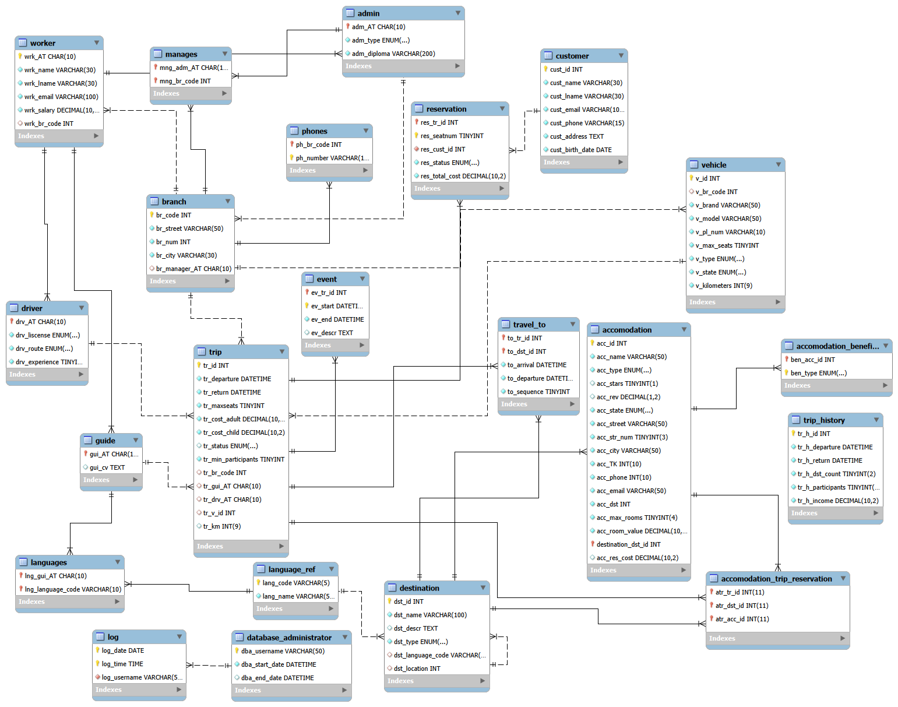

# Travel Agency Database

# Entry-Relationship Diagram

# Contents
- [create.mysql](create.sql)/[insert.mysql](insert.sql) for the basics of the database
- [procedures.mysql](procedures.sql) for the procedures (vehicle insertion, accomodation search and history filters (using indexes))
- [triggers.mysql](triggers.sql) for the triggers (logs, history insertion and calculate reservation costs)
